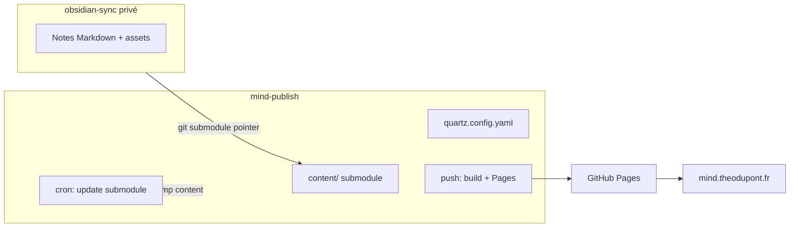

# mind.theodupont.fr — Quartz + Obsidian

Site statique généré avec [Quartz v5](https://quartz.jzhao.xyz/). Le contenu provient d’un vault Obsidian privé versionné dans un dépôt séparé, intégré ici comme **submodule Git** (`content/`).

**Site en production :** [https://mind.theodupont.fr](https://mind.theodupont.fr)

## Les deux dépôts

| Dépôt | URL | Rôle |
|-------|-----|------|
| **mind-publish** | `git@github.com:Sioood/mind-publish.git` | Code Quartz, configuration, CI/CD, GitHub Pages |
| **obsidian-sync** | `git@github.com:Sioood/obsidian-sync.git` | Vault Obsidian privé (notes, assets, `.obsidian`) — submodule `content/` |

- Modifiez vos **notes** dans **obsidian-sync** (Obsidian, sync, etc.).
- Modifiez la **config du site** (thème, plugins, filtres) dans **mind-publish** (`quartz.config.yaml`).

## Architecture



1. Vous poussez des changements vers **obsidian-sync**.
2. Le workflow **Update vault submodule** (toutes les 24 h, ou manuellement) avance le pointeur `content/` dans mind-publish et commit.
3. Ce commit déclenche **Deploy Quartz site** → build → GitHub Pages.

## Prérequis

- [Node.js 24](https://nodejs.org/) (voir `.node-version`)
- npm
- git
- Accès SSH GitHub aux dépôts `Sioood/mind-publish` et `Sioood/obsidian-sync`

## Setup initial (une fois)

### 1. Cloner mind-publish avec le submodule

```bash
git clone --recurse-submodules git@github.com:Sioood/mind-publish.git
cd mind-publish
```

Si le dépôt est déjà cloné sans submodule :

```bash
git submodule update --init --recursive
```

### 2. Remotes (développement local)

```bash
git remote -v
# origin → git@github.com:Sioood/mind-publish.git
# upstream → https://github.com/jackyzha0/quartz.git  (mises à jour Quartz)
```

Pour récupérer les mises à jour upstream Quartz : voir [la doc Quartz](https://quartz.jzhao.xyz/cli/sync).

### 3. Deploy key + secret (submodule privé)

Le vault **obsidian-sync** est privé. Le `GITHUB_TOKEN` de mind-publish **ne peut pas** cloner un autre dépôt privé. Il faut une clé SSH dédiée.

| Étape | Où | Action |
|-------|-----|--------|
| 1 | Machine locale | `ssh-keygen -t ed25519 -C "mind-publish-submodule" -f obsidian-sync-deploy -N ""` |
| 2 | [obsidian-sync → Settings → Deploy keys](https://github.com/Sioood/obsidian-sync/settings/keys) | Coller le contenu de `obsidian-sync-deploy.pub`, titre ex. `mind-publish CI`, **lecture seule** |
| 3 | [mind-publish → Settings → Secrets → Actions](https://github.com/Sioood/mind-publish/settings/secrets/actions) | Nouveau secret `SUBMODULE_DEPLOY_KEY` = contenu complet de `obsidian-sync-deploy` (clé **privée**) |

Les workflows `deploy.yml` et `update-vault-submodule.yml` utilisent ce secret pour `actions/checkout` avec `submodules: recursive` (clone **obsidian-sync** uniquement).

Le push du pointeur submodule vers **mind-publish** utilise le `GITHUB_TOKEN` du workflow (`permissions: contents: write`), pas la deploy key. **Ne pas** activer l’écriture sur la deploy key d’obsidian-sync pour corriger un push : la clé n’a pas accès à mind-publish.

### 4. GitHub Pages

Sur [mind-publish → Settings → Pages](https://github.com/Sioood/mind-publish/settings/pages) :

- **Source :** GitHub Actions (pas « Deploy from a branch »).

### 5. DNS (domaine personnalisé)

- `baseUrl` dans `quartz.config.yaml` : `mind.theodupont.fr`
- Le plugin CNAME génère `public/CNAME` au build.
- Chez votre registrar : enregistrement **CNAME** `mind` → `sioood.github.io` (ou configuration apex selon [la doc GitHub Pages](https://docs.github.com/en/pages/configuring-a-custom-domain-for-your-github-pages-site)).

En attendant la propagation DNS, le site est aussi accessible via `https://sioood.github.io/mind-publish/`.

## Publier une note

Seules les pages avec `publish: true` dans le frontmatter sont incluses (plugin **ExplicitPublish**). Les brouillons avec `draft: true` sont exclus (**RemoveDrafts**).

Exemple :

```yaml
---
title: Ma note publique
publish: true
---
```

**Workflow :**

1. Éditer la note dans Obsidian.
2. **Pousser uniquement vers obsidian-sync** (plugin Obsidian Git, `git push`, etc.).
3. Attendre le cron (06:00 UTC) ou lancer manuellement le workflow **Update vault submodule** sur GitHub.
4. Le deploy se lance automatiquement après le commit du submodule.

> Le site ne reflète pas obsidian-sync tant que le pointeur `content/` dans mind-publish n’a pas été mis à jour.

Dossiers ignorés à la build (voir `ignorePatterns` dans `quartz.config.yaml`) : `private`, `templates`, `extras`, `.obsidian`, `.smart-env`.

## Preview en local

Depuis la racine du dépôt mind-publish :

```bash
git submodule update --init --recursive
npm ci
npx quartz plugin install
npx quartz build
npx quartz serve
```

Ouvrir [http://localhost:8080](http://localhost:8080).

Variante (build + serve en une commande) :

```bash
npx quartz build --serve
```

Le contenu est lu depuis `content/` (submodule). Pas besoin de `-d content` sauf si vous pointez vers un autre dossier.

## Mettre à jour le site (production)

| Méthode | Comment |
|---------|---------|
| **Automatique** | Workflow **Update vault submodule** — cron `0 6 * * *` (06:00 UTC) |
| **Manuel (CI)** | Actions → **Update vault submodule** → *Run workflow* |
| **Manuel (local)** | `git submodule update --remote content && git add content && git commit -m "chore: bump obsidian-sync submodule" && git push` |
| **Rebuild seul** | Actions → **Deploy Quartz site to GitHub Pages** → *Run workflow* |

Après un bump du submodule, **Deploy** se déclenche sur push vers la branche `v5`.

## Modifier la configuration du site

Fichiers principaux :

- `quartz.config.yaml` — titre, thème, plugins, `ignorePatterns`, `baseUrl`
- `quartz.lock.json` — versions des plugins communautaires

Après modification :

```bash
npx quartz plugin install   # si nouveaux plugins
git add quartz.config.yaml quartz.lock.json
git commit -m "chore: update site config"
git push
```

Pousser sur **mind-publish**, pas sur obsidian-sync.

## Workflows GitHub Actions

| Fichier | Déclencheur | Rôle |
|---------|-------------|------|
| `.github/workflows/deploy.yml` | Push sur `v5`, `workflow_dispatch` | Build + déploiement GitHub Pages |
| `.github/workflows/update-vault-submodule.yml` | Cron quotidien, `workflow_dispatch` | Met à jour `content/` depuis obsidian-sync |

Branche de production : **`v5`**.

## Dépannage

### `content/` vide après clone

```bash
git submodule update --init --recursive
```

### Build CI échoue au checkout / submodule

- Vérifier que `SUBMODULE_DEPLOY_KEY` est défini sur mind-publish.
- Vérifier que la deploy key publique est bien sur obsidian-sync (lecture seule suffit).

### `Permission to Sioood/mind-publish.git denied to deploy key` (update submodule)

Le commit local réussit mais le `git push` échoue : `checkout` avec `ssh-key` configure aussi `origin` sur la deploy key d’obsidian-sync. Le workflow doit repasser `origin` en HTTPS + `GITHUB_TOKEN` avant le push (déjà corrigé dans `update-vault-submodule.yml`). Vérifier aussi que le workflow a `permissions: contents: write` et que la branche `v5` n’a pas de règle bloquant `github-actions[bot]`.

### Une note n’apparaît pas sur le site

- `publish: true` dans le frontmatter ?
- Pas `draft: true` ?
- Le submodule a-t-il été bumpé et déployé après le push vers obsidian-sync ?
- Le fichier n’est pas dans un dossier ignoré (`extras`, `private`, etc.) ?

### Lien vers une page privée depuis une page publique

Comportement attendu : la page privée renvoie une 404. Éviter de lier des wikilinks vers des notes non publiées.

### Assets privés

Les filtres Quartz ne s’appliquent qu’aux fichiers `.md`. Les images et PDF dans le vault peuvent être copiés dans `public/` même sans lien. Ne pas stocker de fichiers sensibles dans des chemins servis par la build, ou les exclure via `ignorePatterns`.

## Liens utiles

- [Quartz — Hosting](https://quartz.jzhao.xyz/hosting)
- [Quartz — Configuration](https://quartz.jzhao.xyz/configuration)
- [ExplicitPublish](https://quartz.jzhao.xyz/plugins/ExplicitPublish)
- [Setup Quartz + Obsidian (Oliver Falvai)](https://oliverfalvai.com/evergreen/my-quartz-+-obsidian-note-publishing-setup)
